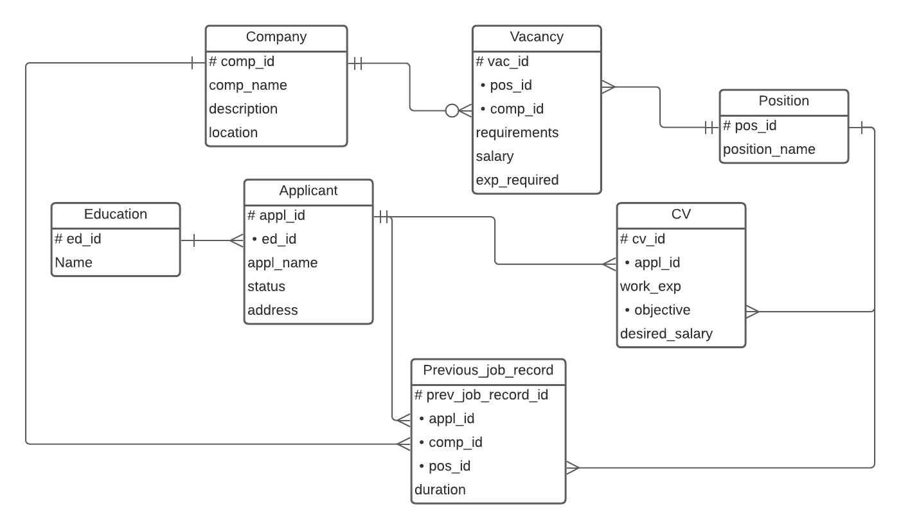

# Web-application. Кадровое агенство

## Описание страниц

### Главная страница
Условно делится на две части:
1. Для работодателей (ссылка на список соискателей, ссылка на список резюме)
2. Для соискателей (ссылка на список работодателей, ссылка на список всех открытых вакансий).

### Список работодателей
1. Возможность добавить нового работодателя.
2. Ссылка на страницу выбранного работодателя
3. Сортировка и фильтры

### Список соискателей
1. Возможность добавить нового соискателя.
2. Ссылка на страницу выбранного соискателя
3. Сортировка и фильтры (по желаемой зарплате, опыту, истории трудоустройства)

### Список вакансий
1. Ссылка на страницу выбранной вакансии
2. Сортировка и фильтры (по желаемой зарплате, требуемому опыту, требованиям)

### Список резюме
1. Ссылка на страницу выбранноой вакансии
2. Сортировка и фильтры (по желаемой зарплате, опыту, требованиям)

### Работодатель
1. Название компании, описание
2. Список доступных вакансий компании
3. Кнопка 'добавить вакансию'
4. Кнопка 'редактировать'

### Соискатель
1. Имя, био, образование, адрес, предыдущие места работы, статус (ищет работу / не ищет)
2. Список резюме соискателя
3. Кнопка 'Добавить резюме'
4. Кнопка 'редактировать'

### Вакансия
1. Описание вакансии, требования
2. Ссылка на работодателя
3. Кнопка 'редактировать'

### Резюме
1. Навыки, опыт.
2. Ссылка на соискателя
3. Кнопка 'редактировать'

## Схема БД

## Use cases
### Получение истории работы для данного человека
- Главная страница
- Список соискателей
- Перейти на страницу нужного соискателя
- Посмотреть поле 'предыдущие места работы'
### Поиск подходящих вакансий на резюме и подходящих резюме на вакансию
- Перейти на страницу со списком вакансий / резюме
- Выставить фильтр по необходимым требованиям, опыту, т.д.
### Получение списка вакансий по компаниям, должностям, зарплатам
- Перейти на страницу списка вакансий
- Выставить фильтр
### Добавление и удаление данных о человеке, чтение и редактирование данных о нем, добавление данных о новом трудоустройстве
Добавить соискателя можно на странице списка соискателей (кнопка добавить).
Чтобы изменить существующую страницу:

- Перейти на страницу соискателя
- Нажать 'редактировать'
- Выставить нужные поля и сохранить

### Добавление и удаление компании, чтение и редактирование данных о них, добавление, удаление и редактирование вакансий
- Аналогично прошлому пункту с точностью до названия кнопок и страниц ('добавить' на странице списка работодателей, 'редактировать' на странице работодателя)
